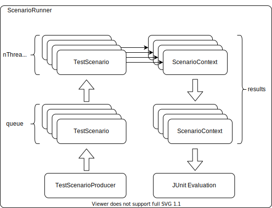

# Test Meter
Testing parallel scenarios in Java and JUnit5 made easy. 



### Build and Run
```
gradle clean build test
gradle publish
```

### Example of use
1. [include dependency](https://search.maven.org/artifact/one.microproject.testmeter/test-meter) 
2. Implement [``TestScenario<ScenarioContext, ScenarioResponse>``](src/main/java/one/microproject/testmeter/TestScenario.java)
3. Implement [``TestScenarioProducer<ScenarioContext, ScenarioResponse>``](src/main/java/one/microproject/testmeter/TestScenarioProducer.java)
4. Use in test like this one [``ExampleScenarioTest``](src/test/java/one/microproject/testmeter/tests/ExampleScenarioTest.java).
